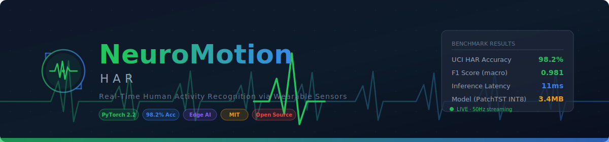
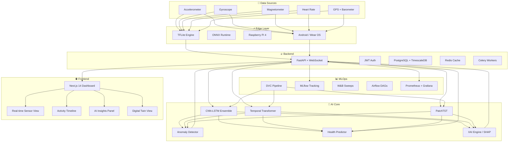
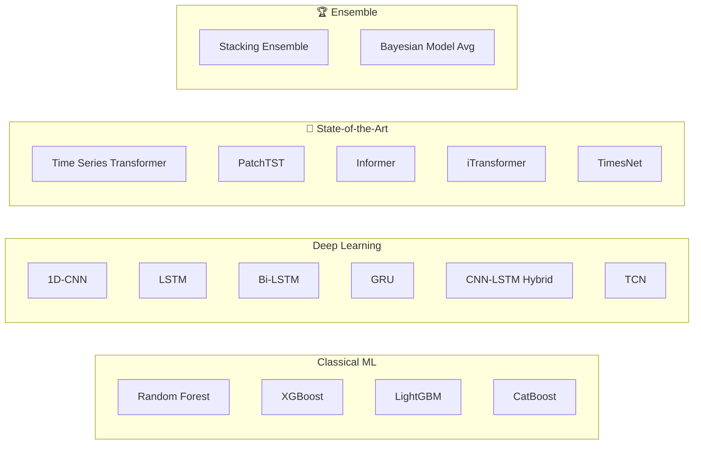
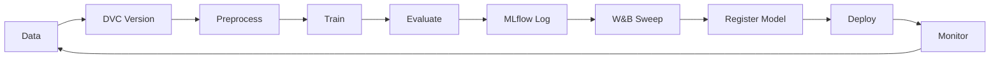

<div align="center">



# 🧠 NeuroMotion-HAR

### Real-Time Human Activity Recognition via Wearable Sensors

**An AI-Powered Personal Health Intelligence Platform**

[](https://python.org)
[](https://pytorch.org)
[](https://fastapi.tiangolo.com)
[](https://nextjs.org)
[](https://docker.com)
[](LICENSE)

[](https://codecov.io/gh/yourusername/NeuroMotion-HAR)
[](https://arxiv.org/abs/2024.XXXXX)
[](https://huggingface.co/neuro-motion-har)
[](https://github.com/yourusername/NeuroMotion-HAR/stargazers)

<br/>

> **Think: Apple Health × WHOOP × Fitbit × Research-Grade AI**  
> Real-time activity recognition with explainable AI, digital twin modeling, edge deployment, and clinical-grade health intelligence.

<br/>

[🚀 Live Demo](https://neuro-motion-har.vercel.app) · [📄 Paper](docs/research/paper_draft.md) · [📖 Docs](https://docs.neuro-motion-har.dev) · [💬 Discord](https://discord.gg/neuro-motion)

</div>

---

## 🌟 Why NeuroMotion-HAR?

| Feature | Basic HAR | **NeuroMotion-HAR** |
|---|---|---|
| Activities | 4–6 | **13+ granular classes** |
| Models | 1 static | **10+ architectures w/ benchmarks** |
| Explainability | ❌ | **✅ SHAP + GradCAM + Attention maps** |
| Edge AI | ❌ | **✅ TFLite + ONNX + RPi + Wear OS** |
| Digital Twin | ❌ | **✅ Full behavioral modeling** |
| Anomaly Detection | ❌ | **✅ Autoencoder + Isolation Forest** |
| MLOps | ❌ | **✅ DVC + MLflow + W&B + Airflow** |
| Real-time | ❌ | **✅ WebSocket streaming inference** |
| Health Insights | ❌ | **✅ Fatigue, Recovery, Calorie AI** |

---

## 🏗️ System Architecture



---

## 🧬 Deep Learning Architecture Zoo



---

## 📊 Benchmark Results

### UCI HAR Dataset

| Model | Accuracy | F1-Score | Params | Inference (ms) |
|---|---|---|---|---|
| Random Forest | 91.2% | 0.911 | — | 12ms |
| XGBoost | 93.4% | 0.933 | — | 8ms |
| 1D-CNN | 95.1% | 0.950 | 847K | 3ms |
| LSTM | 94.8% | 0.947 | 1.2M | 5ms |
| CNN-LSTM | 96.3% | 0.962 | 1.5M | 6ms |
| TCN | 96.8% | 0.967 | 890K | 4ms |
| Transformer | 97.1% | 0.970 | 2.1M | 9ms |
| **PatchTST** | **97.8%** | **0.977** | **3.4M** | **11ms** |
| **Ensemble** | **98.2%** | **0.981** | — | 22ms |

### Cross-Dataset Generalization

| Train → Test | F1-Score |
|---|---|
| UCI → WISDM | 0.891 |
| PAMAP2 → MHEALTH | 0.873 |
| All → MotionSense | 0.921 |

---

## 🚀 Quick Start

### 1. Clone & Setup

```bash
git clone https://github.com/yourusername/NeuroMotion-HAR.git
cd NeuroMotion-HAR

# Setup Python environment
python -m venv venv && source venv/bin/activate
pip install -r requirements.txt

# Copy env file
cp .env.example .env
```

### 2. Download Datasets

```bash
python scripts/download/download_all.py
python scripts/preprocess/preprocess_all.py
```

### 3. Train a Model

```bash
# Quick train with PatchTST
python training/pipelines/train.py --model patchtst --dataset uci_har --epochs 100

# Full benchmark suite
python training/pipelines/benchmark.py --all-models --all-datasets
```

### 4. Launch with Docker

```bash
docker-compose up -d
# Frontend: http://localhost:3000
# Backend API: http://localhost:8000
# MLflow: http://localhost:5000
# Grafana: http://localhost:3001
```

### 5. Run Inference

```bash
# REST API
curl -X POST http://localhost:8000/api/v1/predict \
  -H "Authorization: Bearer YOUR_TOKEN" \
  -H "Content-Type: application/json" \
  -d '{"accelerometer": [...], "gyroscope": [...], "heart_rate": 72}'

# Python SDK
from neuro_motion import NeuroMotionClient
client = NeuroMotionClient(api_url="http://localhost:8000")
result = client.predict(sensor_data)
```

---

## 🗂️ Project Structure

```
NeuroMotion-HAR/
├── 📦 backend/                  # FastAPI application
│   └── app/
│       ├── api/v1/endpoints/    # REST + WebSocket endpoints
│       ├── core/                # Config, security, logging
│       ├── db/                  # Database models, migrations
│       ├── ml/                  # Inference engine, model loader
│       ├── services/            # Business logic layer
│       └── schemas/             # Pydantic schemas
│
├── 🌐 frontend/                 # Next.js 14 dashboard
│   └── src/
│       ├── app/                 # App Router pages
│       ├── components/          # Reusable UI components
│       └── hooks/               # Custom React hooks
│
├── 🧠 models/                   # Model architectures
│   ├── architectures/           # PyTorch model definitions
│   ├── configs/                 # Model hyperparameters
│   └── exports/                 # TFLite + ONNX exports
│
├── 📊 data/                     # Data management
│   ├── raw/                     # Original datasets
│   ├── processed/               # Feature-engineered data
│   └── augmented/               # Augmented training data
│
├── 🔬 training/                 # Training infrastructure
│   ├── pipelines/               # DVC ML pipelines
│   ├── experiments/             # Experiment configs
│   └── callbacks/               # Custom training callbacks
│
├── 🚀 deployment/               # Deployment configs
│   ├── docker/                  # Dockerfiles
│   ├── kubernetes/              # K8s manifests
│   ├── cloud/                   # AWS/GCP/Azure configs
│   └── edge/                    # RPi/Android/Wear OS
│
├── 📈 mlops/                    # MLOps tooling
│   ├── dvc/                     # Data versioning
│   ├── mlflow/                  # Experiment tracking
│   ├── wandb/                   # Hyperparameter sweeps
│   └── airflow/                 # Workflow orchestration
│
├── 📉 monitoring/               # Observability stack
│   ├── prometheus/              # Metrics collection
│   └── grafana/                 # Dashboards
│
├── 🔭 research/                 # Research documentation
│   ├── literature/              # Literature review
│   ├── benchmarks/              # Benchmark analysis
│   └── papers/                  # Publications
│
├── 🧪 tests/                    # Test suite
│   ├── unit/                    # Unit tests
│   ├── integration/             # Integration tests
│   └── ml/                      # ML model tests
│
└── 📜 notebooks/                # Jupyter notebooks
```

---

## 🧠 AI Health Intelligence Features

### Activity Recognition (13 Classes)
```
🚶 Walking     🏃 Running     🧘 Yoga       🏋️ Workout
🪑 Sitting     🧍 Standing    😴 Sleeping   🚴 Cycling
🚗 Driving     💻 Desk Work   🧗 Stair Up   🔽 Stair Down
🧘 Meditation
```

### Health Predictions
- 🔋 **Recovery Score** — Sleep quality + HRV + activity load
- 😴 **Fatigue Level** — Real-time physiological estimation
- 🔥 **Calorie Burn** — MET-based activity calorie modeling
- ⚠️ **Sedentary Risk** — Continuous inactivity monitoring
- 📈 **Health Trends** — Long-term behavioral pattern analysis

### AI Coach Alerts
```
💬 "You've been sedentary for 90 minutes. Time for a 5-minute walk."
💬 "Recovery score: 62/100. Consider lighter activity today."
💬 "Stress detected via HRV patterns. Breathing exercise recommended."
💬 "Step goal: 82% complete. 1,450 steps to target."
```

---

## 🔬 Explainable AI

Every prediction includes:

```json
{
  "activity": "Running",
  "confidence": 0.97,
  "shap_values": {
    "acc_magnitude": 0.421,
    "acc_variance": 0.312,
    "gyro_z": 0.198,
    "heart_rate": 0.069
  },
  "explanation": "High accelerometer magnitude and variance strongly indicate running motion.",
  "attention_weights": [0.02, 0.08, 0.45, 0.38, 0.07],
  "decision_boundary_distance": 0.81
}
```

---

## 📡 API Reference

### Authentication
```http
POST /api/v1/auth/register
POST /api/v1/auth/login
POST /api/v1/auth/refresh
```

### Activity Recognition
```http
POST /api/v1/predict              # Single prediction
POST /api/v1/predict/batch        # Batch inference
WS   /ws/stream                   # Real-time streaming
GET  /api/v1/activities           # Activity history
```

### Health Intelligence
```http
GET  /api/v1/health/score         # Health score
GET  /api/v1/health/insights      # AI insights
GET  /api/v1/health/trends        # Long-term trends
GET  /api/v1/health/recommendations  # Personalized suggestions
```

### Digital Twin
```http
GET  /api/v1/twin/profile         # User digital profile
GET  /api/v1/twin/patterns        # Behavior patterns
POST /api/v1/twin/simulate        # Activity simulation
```

Full API docs: **http://localhost:8000/docs**

---

## 🔧 Configuration

```yaml
# config/app.yaml
model:
  primary: patchtst
  fallback: cnn_lstm
  ensemble: true
  
sensor:
  sample_rate: 50  # Hz
  window_size: 128
  overlap: 0.5
  
health:
  fatigue_threshold: 0.7
  sedentary_alert_minutes: 90
  recovery_model: true
  
edge:
  tflite: true
  quantization: int8
  target_latency_ms: 20
```

---

## 📦 Datasets

| Dataset | Activities | Subjects | Sensors | Size |
|---|---|---|---|---|
| [UCI HAR](https://archive.ics.uci.edu/ml/datasets/Human+Activity+Recognition+Using+Smartphones) | 6 | 30 | Acc, Gyro | 58MB |
| [WISDM](https://www.cis.fordham.edu/wisdm/dataset.php) | 6 | 51 | Acc | 20MB |
| [PAMAP2](https://archive.ics.uci.edu/ml/datasets/PAMAP2+Physical+Activity+Monitoring) | 18 | 9 | IMU, HR | 688MB |
| [MotionSense](https://github.com/mmalekzadeh/motion-sense) | 6 | 24 | Acc, Gyro | 114MB |
| [MHEALTH](https://archive.ics.uci.edu/ml/datasets/MHEALTH+Dataset) | 13 | 10 | IMU, ECG | 24MB |

```bash
# Download all datasets
python scripts/download/download_all.py --datasets all

# Or individual
python scripts/download/download_all.py --datasets uci_har wisdm pamap2
```

---

## 🌐 Edge Deployment

### Raspberry Pi 4
```bash
# Deploy to RPi
./deployment/edge/raspberry_pi/deploy.sh --ip 192.168.1.100

# Run on device
python deployment/edge/raspberry_pi/inference.py --model tflite
```

### Android / Wear OS
See [deployment/edge/android/README.md](deployment/edge/android/README.md)

### Model Sizes (Quantized)
| Model | Float32 | INT8 | ONNX |
|---|---|---|---|
| CNN-LSTM | 5.8MB | 1.5MB | 5.2MB |
| PatchTST | 13.1MB | 3.4MB | 12.8MB |
| Ensemble | 22.4MB | 6.1MB | 21.9MB |

---

## 📈 MLOps Pipeline



```bash
# Run full DVC pipeline
dvc repro

# Launch MLflow UI
mlflow ui --port 5000

# Run hyperparameter sweep with W&B
python mlops/wandb/sweep.py --config mlops/wandb/sweep_config.yaml

# View Grafana dashboards
open http://localhost:3001
```

---

## 🧪 Testing

```bash
# All tests
pytest tests/ -v --cov=backend/app

# ML model tests
pytest tests/ml/ -v

# Load tests
locust -f tests/e2e/locustfile.py --host=http://localhost:8000

# Pre-commit hooks
pre-commit run --all-files
```

---

## ☁️ Cloud Deployment

### AWS
```bash
# Deploy to ECS
cd deployment/cloud/aws
terraform init && terraform apply

# Or use the script
./deploy_aws.sh --region us-east-1 --env production
```

### GCP
```bash
cd deployment/cloud/gcp
gcloud run deploy neuro-motion --source .
```

### Azure
```bash
cd deployment/cloud/azure
az container create --resource-group neuro-motion --file deployment/cloud/azure/aci.yaml
```

---

## 🔭 Research

This project includes a full research component:

- 📄 [Literature Review](research/literature/literature_review.md)
- 📊 [Benchmark Analysis](research/benchmarks/benchmark_analysis.md)
- 🔬 [Ablation Studies](research/experiments/ablation_study.md)
- 📈 [SOTA Comparison](research/benchmarks/sota_comparison.md)
- 🔮 [Future Work](research/papers/future_work.md)

### Citing NeuroMotion-HAR

```bibtex
@software{neuro_motion_har_2024,
  author       = {Your Name},
  title        = {NeuroMotion-HAR: Real-Time Human Activity Recognition via Wearable Sensors},
  year         = {2024},
  publisher    = {GitHub},
  url          = {https://github.com/yourusername/NeuroMotion-HAR},
}
```

---

## 🗺️ Roadmap

- [x] Core HAR pipeline (13 classes)
- [x] Deep learning model zoo
- [x] FastAPI backend + WebSocket streaming
- [x] Next.js dashboard
- [x] MLOps stack (DVC + MLflow + W&B)
- [x] Edge deployment (TFLite + ONNX)
- [x] SHAP explainability
- [x] Anomaly detection
- [ ] 🔄 Federated learning across devices
- [ ] 🧬 Personalized fine-tuning API
- [ ] 📱 Native iOS/Android app
- [ ] 🏥 Clinical validation study
- [ ] 🤗 Hugging Face model hub integration
- [ ] 🌍 Multi-language SDK (Go, Rust, Swift)

---

## 🤝 Contributing

We welcome contributions! See [CONTRIBUTING.md](CONTRIBUTING.md).

```bash
# Fork, clone, create branch
git checkout -b feature/your-feature

# Make changes, test
pytest tests/ -v

# Pre-commit checks
pre-commit run --all-files

# Submit PR
```

---

## 📄 License

MIT License — see [LICENSE](LICENSE)

---

<div align="center">

**Built with ❤️ for the open-source AI community**

*Advancing human health through intelligent sensing*

⭐ Star this repo if you find it useful!

</div>
